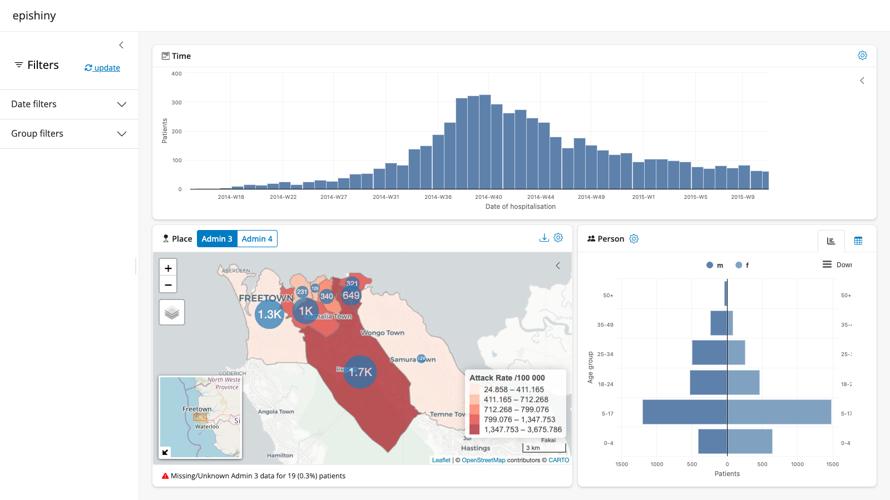
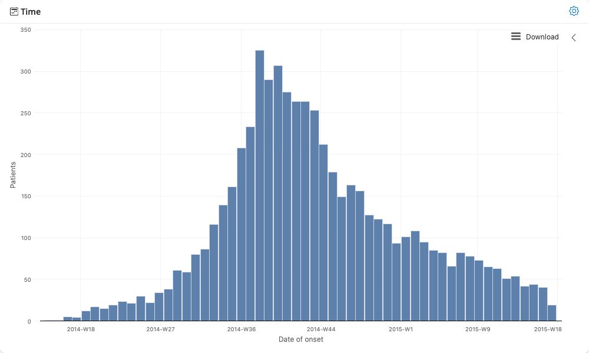
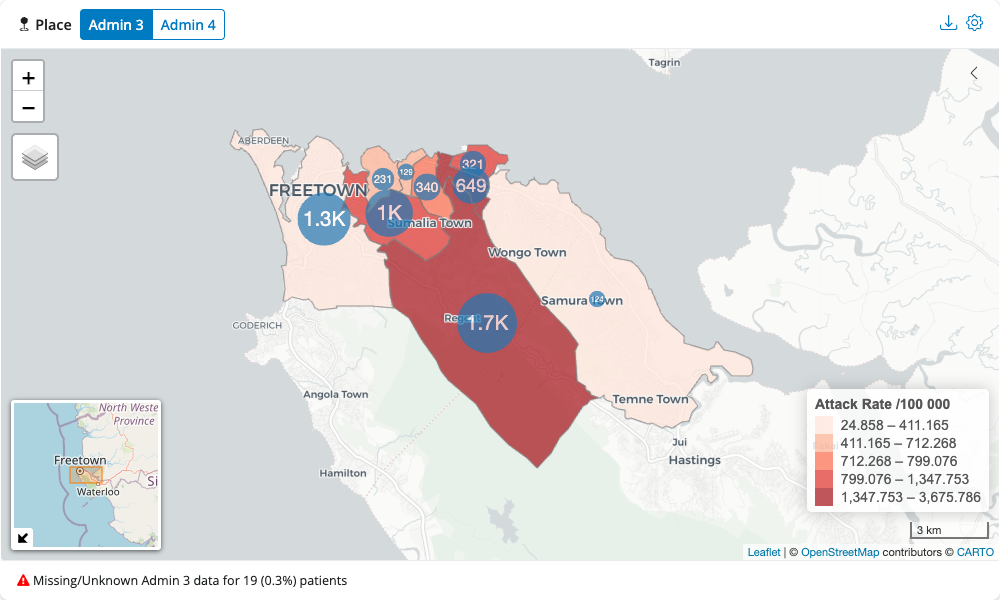
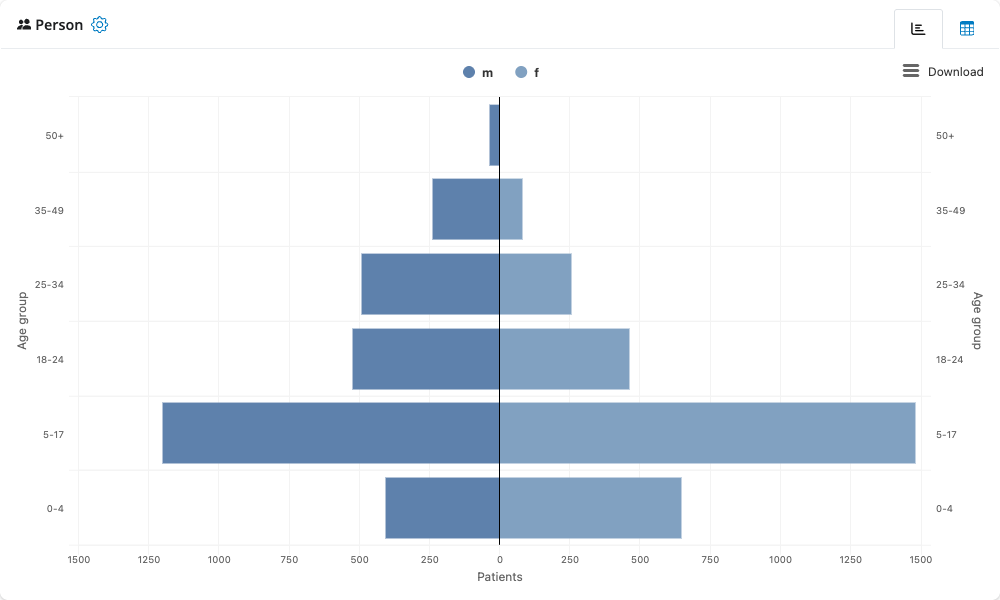

# epishiny

## Global options

`epishiny` sets the following global options on start up that are used
across various modules. You can change any of these to suit your needs
via the [`options()`](https://rdrr.io/r/base/options.html) function as
below. Make sure you do this *after* `epishiny` has been loaded for the
changes to take effect.

``` r

# first load libraries
suppressPackageStartupMessages(library(dplyr))
suppressPackageStartupMessages(library(sf))
suppressPackageStartupMessages(library(epishiny))

# then set your options. the options below are the defaults
options(
  epishiny.na.label = "(Missing)", # label to be used for NA values in outputs
  epishiny.count.label = "Patients", # if data is un-aggregated, the label to represent row counts
  epishiny.week.letter = "W", # letter to represent 'Week'. Change to S for 'Semaine' etc
  epishiny.week.start = 1 # day the epiweek starts on. 1 = Monday, 7 = Sunday
)
```

## Setting up data for epishiny

`epishiny` can work with either aggregated or un-aggregated data. Here
we will use an example of an un-aggregated ‘linelist’ dataset. A
linelist is a (tidy) data format used in public health data collection
with each row representing an individual (patient, participant, etc) and
each column representing a variable associated with said individual.

`df_ll_ebola` is an example dataset within the package containing data
for a simulated Ebola outbreak in Sierra Leone. The data contains
temporal, demographic, and geographic information for each patient, as
well as other medical indicators.

``` r

glimpse(df_ll_ebola)
#> Rows: 5,829
#> Columns: 14
#> $ case_id                 <chr> "d1fafd", "f5c3d8", "6c286a", "0f58c4", "49731…
#> $ generation              <int> 0, 1, 2, 2, 0, 3, 3, 4, 3, 4, 2, 4, 4, 4, 5, 5…
#> $ date_of_infection       <date> NA, 2014-04-18, NA, 2014-04-22, 2014-03-19, N…
#> $ date_of_onset           <date> 2014-04-07, 2014-04-21, 2014-04-27, 2014-04-2…
#> $ date_of_hospitalisation <date> 2014-04-17, 2014-04-25, 2014-04-27, 2014-04-2…
#> $ date_of_outcome         <date> 2014-04-19, 2014-04-30, 2014-05-07, 2014-05-1…
#> $ outcome                 <fct> NA, Recover, Death, Recover, NA, Recover, Deat…
#> $ age                     <dbl> 4, 6, 2, 22, 15, 37, 3, 9, 23, 37, 15, 9, 1, 1…
#> $ gender                  <fct> f, f, f, f, f, f, f, f, f, f, f, f, f, f, f, f…
#> $ hospital                <fct> Military Hospital, other, NA, other, NA, Conna…
#> $ lon                     <dbl> -13.21799, -13.22804, -13.23112, -13.21016, -1…
#> $ lat                     <dbl> 8.473514, 8.483356, 8.464776, 8.452143, 8.4685…
#> $ adm3_pcode              <chr> "SL040102", "SL040201", "SL040207", "SL040102"…
#> $ adm4_pcode              <chr> "SL04010204", "SL04020102", "SL04020704", "SL0…
```

We have geographical patient origin data contained in the `adm` columns,
representing administrative boundary levels in Sierra Leone. To
visualise this data on a map we need to provide accompanying geo data
that we can match to the linelist data. `sf_sle` is a dataset within the
package containing geo boundary data for admin levels 3 and 4 in Sierra
Leone, stored as [sf](https://r-spatial.github.io/sf/) objects.

``` r

sf_sle
#> $adm3
#> Simple feature collection with 9 features and 11 fields
#> Attribute-geometry relationships: constant (3), NAs (8)
#> Geometry type: MULTIPOLYGON
#> Dimension:     XY
#> Bounding box:  xmin: -13.29853 ymin: 8.384533 xmax: -13.11883 ymax: 8.499624
#> Geodetic CRS:  WGS 84
#> # A tibble: 9 × 12
#>   adm0_iso3 adm0_sub adm0_name    adm1_name adm2_name   adm3_name pcode adm3_pop
#> * <chr>     <chr>    <chr>        <chr>     <chr>       <chr>     <chr>    <int>
#> 1 SLE       ALL      Sierra Leone Western   Western Ar… Mountain… SL04…    45106
#> 2 SLE       ALL      Sierra Leone Western   Western Ar… Central I SL04…    45691
#> 3 SLE       ALL      Sierra Leone Western   Western Ar… Central … SL04…    18316
#> 4 SLE       ALL      Sierra Leone Western   Western Ar… East I    SL04…    34887
#> 5 SLE       ALL      Sierra Leone Western   Western Ar… East II   SL04…    32626
#> 6 SLE       ALL      Sierra Leone Western   Western Ar… East III  SL04…   498827
#> 7 SLE       ALL      Sierra Leone Western   Western Ar… West I    SL04…    51938
#> 8 SLE       ALL      Sierra Leone Western   Western Ar… West II   SL04…   128935
#> 9 SLE       ALL      Sierra Leone Western   Western Ar… West III  SL04…   363112
#> # ℹ 4 more variables: lon <dbl>, lat <dbl>, source <chr>,
#> #   geometry <MULTIPOLYGON [°]>
#> 
#> $adm4
#> Simple feature collection with 74 features and 12 fields
#> Attribute-geometry relationships: constant (4), NAs (8)
#> Geometry type: MULTIPOLYGON
#> Dimension:     XY
#> Bounding box:  xmin: -13.29853 ymin: 8.289232 xmax: -13.06064 ymax: 8.499624
#> Geodetic CRS:  WGS 84
#> # A tibble: 74 × 13
#>    adm0_iso3 adm0_sub adm0_name    adm1_name adm2_name adm3_name adm4_name pcode
#>  * <chr>     <chr>    <chr>        <chr>     <chr>     <chr>     <chr>     <chr>
#>  1 SLE       ALL      Sierra Leone Western   Western … Mountain… Bathurst  SL04…
#>  2 SLE       ALL      Sierra Leone Western   Western … Mountain… Charlotte SL04…
#>  3 SLE       ALL      Sierra Leone Western   Western … Mountain… Gloucest… SL04…
#>  4 SLE       ALL      Sierra Leone Western   Western … Mountain… Leicester SL04…
#>  5 SLE       ALL      Sierra Leone Western   Western … Mountain… Regent    SL04…
#>  6 SLE       ALL      Sierra Leone Western   Western … Waterloo… Hastings… SL04…
#>  7 SLE       ALL      Sierra Leone Western   Western … York Rur… Gbendembu SL04…
#>  8 SLE       ALL      Sierra Leone Western   Western … York Rur… Goderich… SL04…
#>  9 SLE       ALL      Sierra Leone Western   Western … York Rur… Goderich… SL04…
#> 10 SLE       ALL      Sierra Leone Western   Western … York Rur… Hamilton  SL04…
#> # ℹ 64 more rows
#> # ℹ 5 more variables: adm4_pop <int>, lon <dbl>, lat <dbl>, source <chr>,
#> #   geometry <MULTIPOLYGON [°]>
```

We can easily match this to the linelist data via the `pcode` columns.
In real world scenarios, you might not have harmonious pcodes available
in your data, so if you need help matching messy epi data to geo data,
check out our [hmatch package](https://epicentre-msf.github.io/hmatch/).

Now let’s set up the geo data in the format required for epishiny. We
use the
[`geo_layer()`](https://epicentre-msf.github.io/epishiny/reference/geo_layer.md)
function to define a layer, and since we have multiple layers in this
case, we combine them in a list.

``` r

# Setup geo data for admin 3 and admin 4 using the
# geo_layer function to be passed to the place module
# If population variable is provided, attack rates
# will be shown on the map as a choropleth
geo_data <- list(
  geo_layer(
    layer_name = "Admin 3", # name of the boundary layer
    sf = sf_sle$adm3, # sf object with boundary polygons
    name_var = "adm3_name", # column with place names
    pop_var = "adm3_pop", # column with population data (optional)
    join_by = c("pcode" = "adm3_pcode") # geo to data join vars: LHS = sf, RHS = data
  ),
  geo_layer(
    layer_name = "Admin 4",
    sf = sf_sle$adm4,
    name_var = "adm4_name",
    join_by = c("pcode" = "adm4_pcode")
  )
)
```

## Building a dashboard

The quickest way to create a full-featured epidemiological dashboard is
with the
[`epi_dashboard()`](https://epicentre-msf.github.io/epishiny/reference/epi_dashboard.md)
function. This function handles all the shiny boilerplate code and gives
you a complete time-place-person dashboard with interactive filtering in
just a few lines of code.

**When to use
[`epi_dashboard()`](https://epicentre-msf.github.io/epishiny/reference/epi_dashboard.md):**
This function is ideal for quickly launching an interactive dashboard to
explore your data during analysis. However, if you’re building a
dashboard for publication or need to include additional analysis, custom
visualizations, or contextual information beyond the standard modules,
you’ll want to build a custom dashboard yourself by incorporating the
individual epishiny modules wherever needed. See the [Custom
dashboards](#custom-dashboards) section below for how to build custom
dashboards.

### Basic dashboard

Here’s a complete dashboard with all three modules (place, time, and
person):

``` r

# Create a complete dashboard
app <- epi_dashboard(
  df = df_ll_ebola,
  # Time module arguments
  date_vars = c("Date of onset" = "date_of_onset"),
  # Place module arguments
  geo_data = geo_data,
  # Person module arguments
  age_var = "age",
  sex_var = "gender",
  male_level = "m",
  female_level = "f",
  # Filter module arguments
  group_vars = c(
    "Hospital" = "hospital",
    "Gender" = "gender",
    "Outcome" = "outcome"
  )
)

# Launch the dashboard
if (interactive()) {
  shiny::runApp(app)
}
```



### Customizing the layout

You can customize which modules to include and how they’re arranged
using the `modules` and `col_widths` arguments:

``` r

# Time module on full-width top row, then place and person below
app <- epi_dashboard(
  df = df_ll_ebola,
  modules = c("time", "place", "person"), # order determines layout
  col_widths = c(12, 7, 5), # time gets 12 cols, place gets 7, person gets 5
  title = "Ebola Outbreak Dashboard",
  date_vars = c(
    "Date of onset" = "date_of_onset",
    "Date of hospitalisation" = "date_of_hospitalisation"
  ),
  geo_data = geo_data,
  age_var = "age",
  sex_var = "gender",
  male_level = "m",
  female_level = "f",
  group_vars = c("Hospital" = "hospital", "Gender" = "gender")
)
```

``` r

# Simple dashboard with just time and person modules (no map)
app <- epi_dashboard(
  df = df_ll_ebola,
  modules = c("time", "person"),
  title = "Time & Demographics",
  date_vars = c("Date of onset" = "date_of_onset"),
  age_var = "age",
  sex_var = "gender",
  male_level = "m",
  female_level = "f"
)
```

``` r

# Dashboard without the filter sidebar
app <- epi_dashboard(
  df = df_ll_ebola,
  include_filter = FALSE,
  date_vars = c("Date of onset" = "date_of_onset"),
  geo_data = geo_data,
  age_var = "age",
  sex_var = "gender",
  male_level = "m",
  female_level = "f"
)
```

The
[`epi_dashboard()`](https://epicentre-msf.github.io/epishiny/reference/epi_dashboard.md)
function automatically routes arguments to the appropriate modules, so
you can pass any argument that the underlying module functions accept.
See
[`?epi_dashboard`](https://epicentre-msf.github.io/epishiny/reference/epi_dashboard.md)
for full details.

## Individual modules

Now let’s look at the individual `time`, `place` and `person` modules
that power the dashboard. Each module can be launched on its own for
quick exploration, or incorporated into custom dashboards. Below is an
example of each module with the minimum required arguments. See each
module’s documentation
([`?time_server`](https://epicentre-msf.github.io/epishiny/reference/time.md),
[`?place_server`](https://epicentre-msf.github.io/epishiny/reference/place.md),
[`?person_server`](https://epicentre-msf.github.io/epishiny/reference/person.md))
for full details of all features and arguments that can be passed.

You can launch any module individually using
[`launch_module()`](https://epicentre-msf.github.io/epishiny/reference/launch_module.md):

``` r

# Time module - interactive epicurves
launch_module(
  module = "time",
  df = df_ll_ebola,
  date_vars = "date_of_onset"
)

# Place module - interactive maps
launch_module(
  module = "place",
  df = df_ll_ebola,
  geo_data = geo_data
)

# Person module - demographics and population pyramids
launch_module(
  module = "person",
  df = df_ll_ebola,
  age_var = "age",
  sex_var = "gender",
  male_level = "m",
  female_level = "f"
)
```



## Custom dashboards

For production dashboards that need additional analysis, context, or
customisation beyond what
[`epi_dashboard()`](https://epicentre-msf.github.io/epishiny/reference/epi_dashboard.md)
provides, you can build custom dashboards by incorporating the
individual epishiny modules into your own shiny application.

`epishiny` modules can be included in any shiny dashboard by adding the
`*_ui()` component to your UI and the `*_server()` component to your
server function. The modules use UI elements from the
[bslib](https://rstudio.github.io/bslib/index.html) package, so you’ll
need to use `bslib` for your dashboard’s user interface. See the [bslib
shiny
dashboards](https://rstudio.github.io/bslib/articles/dashboards/index.html)
article for full details on designing UIs with `bslib`.

If you’re new to shiny, a good place to start is the [Mastering
Shiny](https://mastering-shiny.org/) book by Hadley Wickham.

Below is a complete custom dashboard example incorporating all
`epishiny` modules, which gives you full control over the layout,
additional content, and module interactions:

``` r

library(shiny)
library(bslib)
library(epishiny)

# example package data
data("df_ll_ebola") # linelist
data("sf_sle") # sf geo boundaries for Sierra Leone admin 3 & 4

# setup geo data for admin 3 and admin 4 using the
# geo_layer function to be passed to the place module
# if population variable is provided, attack rates
# will be shown on the map as a choropleth
geo_data <- list(
  geo_layer(
    layer_name = "Admin 3", # name of the boundary level
    sf = sf_sle$adm3, # sf object with boundary polygons
    name_var = "adm3_name", # column with place names
    pop_var = "adm3_pop", # column with population data (optional)
    join_by = c("pcode" = "adm3_pcode") # geo to data join vars: LHS = sf, RHS = data
  ),
  geo_layer(
    layer_name = "Admin 4",
    sf = sf_sle$adm4,
    name_var = "adm4_name",
    join_by = c("pcode" = "adm4_pcode")
  )
)

# define date variables in data as named list to be used in app
date_vars <- c(
  "Date of onset" = "date_of_onset",
  "Date of hospitalisation" = "date_of_hospitalisation",
  "Date of infection" = "date_of_infection",
  "Date of outcome" = "date_of_outcome"
)

# define categorical grouping variables
# in data as named list to be used in app
group_vars <- c(
  "Hospital" = "hospital",
  "Gender" = "gender",
  "Outcome" = "outcome"
)

# user interface
ui <- page_sidebar(
  title = "epishiny",
  # sidebar
  sidebar = filter_ui(
    "filter",
    date_vars = date_vars,
    group_vars = group_vars
  ),
  # main content
  layout_columns(
    col_widths = c(12, 7, 5),
    place_ui(
      id = "map",
      geo_data = geo_data,
      group_vars = group_vars
    ),
    time_ui(
      id = "curve",
      title = "Time",
      date_vars = date_vars,
      group_vars = group_vars,
      ratio_line_lab = "Show CFR line?"
    ),
    person_ui(id = "age_sex")
  )
)

# app server
server <- function(input, output, session) {
  app_data <- filter_server(
    id = "filter",
    df = df_ll_ebola,
    date_vars = date_vars,
    group_vars = group_vars
  )
  place_server(
    id = "map",
    df = app_data$df,
    geo_data = geo_data,
    group_vars = group_vars,
    filter_info = app_data$filter_info
  )
  time_server(
    id = "curve",
    df = app_data$df,
    date_vars = date_vars,
    group_vars = group_vars,
    show_ratio = TRUE,
    ratio_var = "outcome",
    ratio_lab = "CFR",
    ratio_numer = "Death",
    ratio_denom = c("Death", "Recover"),
    filter_info = app_data$filter_info
  )
  person_server(
    id = "age_sex",
    df = app_data$df,
    age_var = "age",
    sex_var = "gender",
    male_level = "m",
    female_level = "f",
    filter_info = app_data$filter_info
  )
}

# launch app
if (interactive()) {
  shinyApp(ui, server)
}
```

This custom approach allows you to:

- Add custom analysis outputs, text, or visualizations alongside
  epishiny modules
- Control the exact layout and styling with bslib components
- Integrate with other shiny modules or packages
- Add custom reactive logic and module interactions
- Include additional UI elements like value boxes, tabs, or navbars
